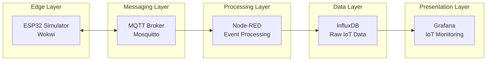
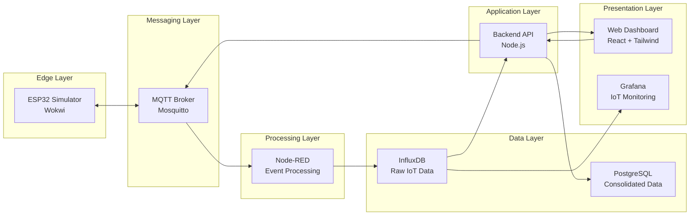

# IoT na Prática: do Sensor ao Dashboard na Nuvem

Este repositório contém o material de apoio da série de videoaulas **IoT na Prática: do Sensor ao Dashboard na Nuvem**.

O objetivo da série é demonstrar, de forma prática, como construir **uma arquitetura IoT completa**, desde a simulação de dispositivos até a visualização de dados em dashboards na nuvem.

Durante as aulas construiremos um sistema inspirado em um **Smart Campus**, onde sensores monitoram o ambiente e enviam dados para uma plataforma de análise em tempo real.


## Objetivos do Projeto

Ao final da série você será capaz de:

- Compreender os principais conceitos de **Internet das Coisas (IoT)**
- Simular dispositivos IoT utilizando **ESP32**
- Enviar dados utilizando o protocolo **MQTT**
- Processar eventos com **Node-RED**
- Armazenar dados de telemetria em **InfluxDB**
- Criar dashboards em **Grafana**
- Construir um **backend em Node.js**
- Criar uma aplicação **frontend em React + TypeScript**
- Persistir dados consolidados em **PostgreSQL**
- Implantar toda a infraestrutura em **AWS EC2 com Docker**


## Cenário do Projeto

O projeto simula um sistema de monitoramento de um **Smart Campus**.

Sensores instalados em laboratórios e salas de aula coletam informações ambientais e enviam os dados para a nuvem, onde são processados, armazenados e exibidos em dashboards.

Exemplos de sensores simulados:

- Temperatura
- Umidade
- Luminosidade
- Presença

Esses dados podem ser utilizados para:

- monitoramento ambiental
- eficiência energética
- análise de ocupação
- automação predial

## Arquitetura do Sistema

A arquitetura construída durante as aulas segue o fluxo abaixo:



Posteriormente evoluímos a arquitetura para incluir backend e frontend:



Também será possível enviar comandos para os dispositivos:

```

Frontend → Backend → MQTT → Dispositivo

```


## Tecnologias Utilizadas

### Dispositivo IoT

- ESP32
- Simulação no Wokwi

### Comunicação

- MQTT
- Mosquitto

### Processamento de Eventos

- Node-RED

### Bancos de Dados

- InfluxDB (Time Series Database)
- PostgreSQL (Relacional)

### Visualização

- Grafana

### Backend

- Node.js
- Express

### Frontend

- React
- TypeScript
- Tailwind CSS

### Infraestrutura

- Docker
- AWS EC2


## Conteúdo da Série

A série está organizada em etapas que acompanham a construção da arquitetura.

### 1️ Introdução ao Projeto IoT

- Conceitos de IoT
- Arquitetura do sistema
- Cenário Smart Campus

### 2️ Arquitetura IoT

- Edge devices
- Telemetria
- Arquiteturas orientadas a eventos

### 3️ Simulação de Dispositivo IoT

- ESP32
- Sensores analógicos e digitais
- Simulação no Wokwi

### 4️ Comunicação com MQTT

- Broker
- Tópicos
- Publisher / Subscriber

### 5️ Processamento com Node-RED

- Fluxos
- Transformação de dados
- Integração com MQTT

### 6️ Armazenamento de Telemetria

- InfluxDB
- Estrutura de dados de séries temporais

### 7️ Dashboards com Grafana

- Conexão com InfluxDB
- Visualização de dados

### 8️ Infraestrutura na Nuvem

- Docker
- Deploy em AWS EC2

### 9️ Backend IoT

- API REST
- Leitura de dados do InfluxDB
- Consolidação de dados

### 10 Banco Relacional

- PostgreSQL
- Estrutura de dados consolidados

### 1️1️ Frontend

- React
- TypeScript
- Tailwind

### 1️2️ Controle de Dispositivos

- Envio de comandos
- Comunicação bidirecional com IoT

## Estrutura do Repositório

```

iot-na-pratica/
│
├── device/
│   └── esp32-simulator
│
├── flows/
│   └── node-red
│
├── backend/
│   └── node-api
│
├── frontend/
│   └── react-dashboard
│
├── docker/
│   └── docker-compose.yml
│
├── database/
│   ├── influxdb
│   └── postgres
│
└── docs/
└── arquitetura

```


## Executando o Projeto

Em breve serão disponibilizados os arquivos de configuração para executar toda a arquitetura utilizando **Docker Compose**.

A infraestrutura incluirá:

- MQTT Broker
- Node-RED
- InfluxDB
- Grafana
- PostgreSQL
- Backend Node.js
- Frontend React


## Público-Alvo

Este material é indicado para:

- estudantes de **Tecnologia da Informação**
- cursos de **Sistemas de Informação**
- cursos de **Análise e Desenvolvimento de Sistemas**
- interessados em **IoT e arquitetura de dados**


## Bibliografia Recomendada

- Designing the Internet of Things — Adrian McEwen
- Designing Data-Intensive Applications — Martin Kleppmann
- Internet of Things: A Hands-On Approach — Arshdeep Bahga
- MQTT Essentials — HiveMQ


## Licença

Este projeto é disponibilizado para fins educacionais.


## Autor

Material desenvolvido para apoio às aulas da disciplina de **Internet das Coisas e Arquiteturas de Dados**.
```

---

Se quiser, eu também posso te gerar **3 coisas que deixam esse repositório MUITO mais profissional para alunos**:

1️⃣ **diagrama de arquitetura em SVG para colocar no README**
2️⃣ **docker-compose completo da arquitetura IoT**
3️⃣ **estrutura ideal do repositório para aula (padrão usado em cursos internacionais)**

Isso deixa o projeto **nível GitHub de curso profissional**.
